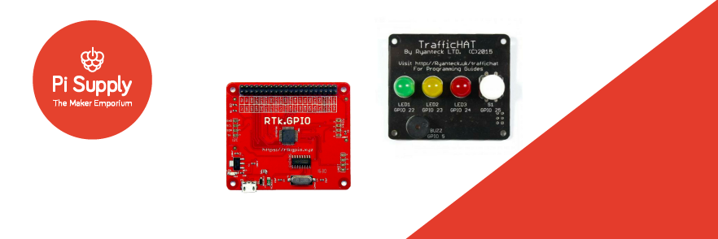
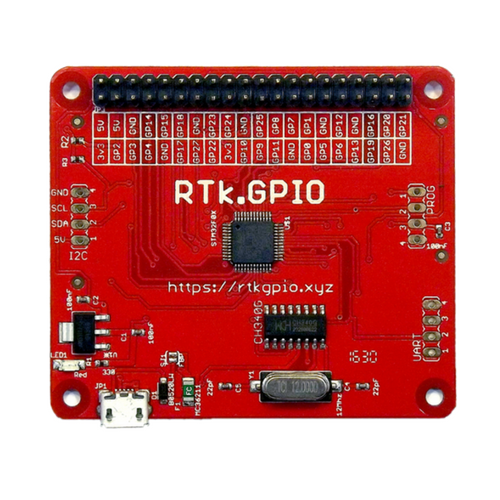

# Ryanteck

[Pi-Supply](https://uk.pi-supply.com) is one of the official distributers and manufacturers of [Ryanteck](https://ryanteck.uk) products including; RTK.GPIO, RTK Motor Controller board and RTC Traffic HAT for the Raspberry Pi. These product were designed by Ryan Walmsley at Ryanteck Ltd.

# Board overview

## RTK.GPIO

The RTK GPIO board allows you to connect the world of physical computing to you desktop PC or laptop. The RTK GPIO board emulates the original Raspberry Pi 28-pin GPIO header allowing you to program for the Raspberry Pi on your computer. The board is fully compatible with Windows, Mac OS and Linux and supports a range of programming languages such as Python, Java and also use with Scratch.

The board connects to your computer using a micro USB cable , which also provides power to the board.

## RTK Motor Controller

The new and improved RTK-000-001-V3 / Motor Controller Board for Raspberry Pi is now pre-soldered and features a new and improved design breaking out the GPIO Pins to the side of the board.

The Ryanteck Raspberry Pi Motor Controller Board is a simple to use & budget friendly motor controller board for the Raspberry Pi which allows you to easily control 2 motors in both directions with some simple coding!

Once you receive the board, simply place it on the Raspberry Pi's GPIO header, screw in a power pack, add your motors and then start programming. We officially support Python & Scratch at this point in time although you can use it with any language that allows you to control the GPIO pins including C, Java, PHP, Bash, Node.JS etc.

## RTK Traffic HAT

The traffic HAT is designed for beginners to teach the basics or programming the real world with a traffic light sequence of LEDs. The HAT has 3 on-board LEDs (Red, Yellow, Green) with a push button and piezo buzzer.

The TrafficHAT Comes as a half soldered, half kit package. The 40 way header, HAT EEPROM Circuit and resistors for the button are pre soldered on the bottom side. You will be required to solder the 3 LEDs, Button and Buzzer.

## Where to buy

* [Pi Supply](https://uk.pi-supply.com)
