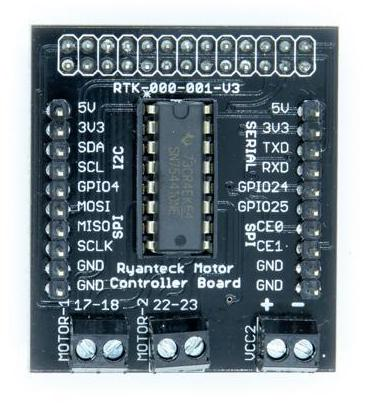

# RTK Motor Controller Board

The above image of the RTK Motor Controller Board PCB is used in the following descriptions to highlight some of the inputs and outputs and other useful hardware information of the board.

## Motor-1 Motor-2

These two screw terminals are used to connect two motors to the motor controller board. You can connect the wires from your motor to the terminals by un-screwing the screw and inserting the wire into the hole and the screw the terminal back down. The red wire should be inserted into the most left screw hole and the black next to it for a clockwise motor direction.

## VCC2

VCC2 screw terminal provides power to the motors and the motor controller chip. You can connect a power supply from 4.5V to 12V  with current up to 1A. The left terminal it the +V (Red wire) and the right terminal is GND (Black wire).

## GPIO Breakout Headers

There are two rows of 10 GPIO headers, which are breakout from the main 26-way Raspberry Pi GPIO header, JP2 and JP3 and also connected to the power input of VCC.

| JP3 | GPIO | JP2 | GPIO |
|-----|------|-----|------|
| 1   | VCC  | 1   | 5V      |
| 2   | 3V3  | 2   | 3V3     |
| 3   | GPIO 2| 3  | GPIO 14 |
| 4   | GPIO 3| 4  | GPIO 15 |
| 5   | GPIO 4| 5  | GPIO 24 |
| 6   | GPIO 10| 6 | GPIO 25 |
| 7   | GPIO 9| 7  | GPIO 8  |
| 8   | GPIO 11| 8 | GPIO 7  |
| 9   | GND | 9    | GND     |
| 10  | GND | 10   | GND     |

## SN75441ONE

The main active component is the SN75441ONE H-Bridge motor controller by TI.

| Pin Number | Label  | Connected to |
|------------|--------|--------------|
| 1          | 1,2 EN | VCC          |
| 2          | 1A     | GPIO 17      |
| 3          | 1Y     | Motor A 1    |
| 4          | GND_3  | GND          |
| 5          | GND_4  | GND          |
| 6          | 2Y     | Motor A 2    |
| 7          | 2A     | GPIO 18      |
| 8          | VCC2   | VCC/2        |
| 9          | 3,4 EN | VCC          |
| 10         | 3A     | GPIO 22      |
| 11         | 3Y     | Motor B 2    |
| 12         | GND    | GND          |
| 13         | GND_2  | GND          |
| 14         | 4Y     | Motor B 1    |
| 15         | 4A     | GPIO 23      |
| 16         | VCC 1  | VCC          |
