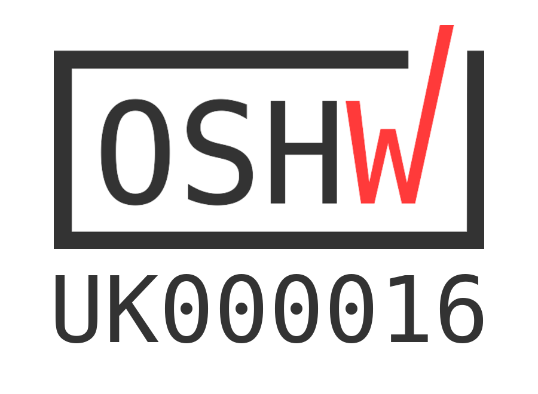

# RTK Motor Controller

The new and improved RTK-000-001-V3 / Motor Controller Board for Raspberry Pi is now pre-soldered and features a new and improved design breaking out the GPIO Pins to the side of the board.

The Ryanteck Raspberry Pi Motor Controller Board is a simple to use & budget friendly motor controller board for the Raspberry Pi which allows you to easily control 2 motors in both directions with some simple coding!

Once you receive the board, simply place it on the Raspberry Pi's GPIO header, screw in a power pack, add your motors and then start programming. We officially support Python & Scratch at this point in time although you can use it with any language that allows you to control the GPIO pins including C, Java, PHP, Bash, Node.JS etc.

## Open Source Hardware

We are proud to say that the RTk.MCB is certified by the [Open Source Hardware Association](https://certification.oshwa.org/uk000016.html) with UID number UK000016. Our certification mark is below:

