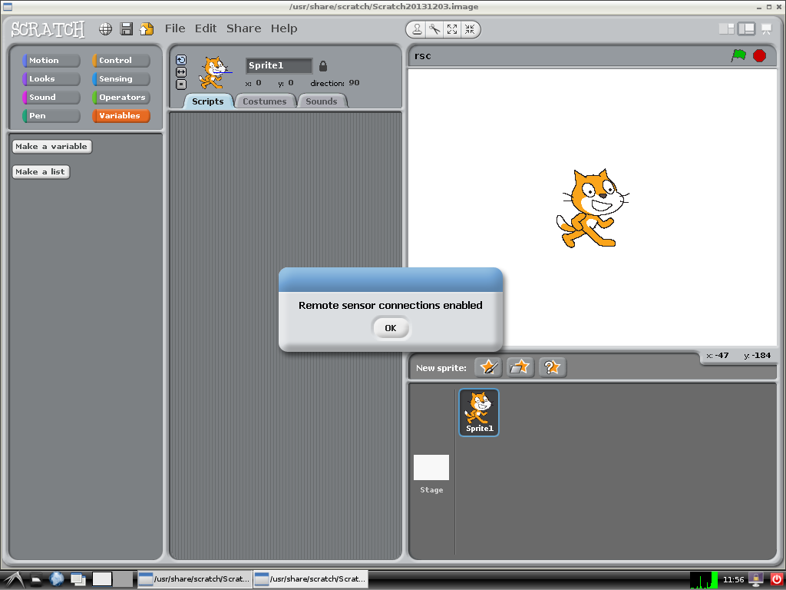
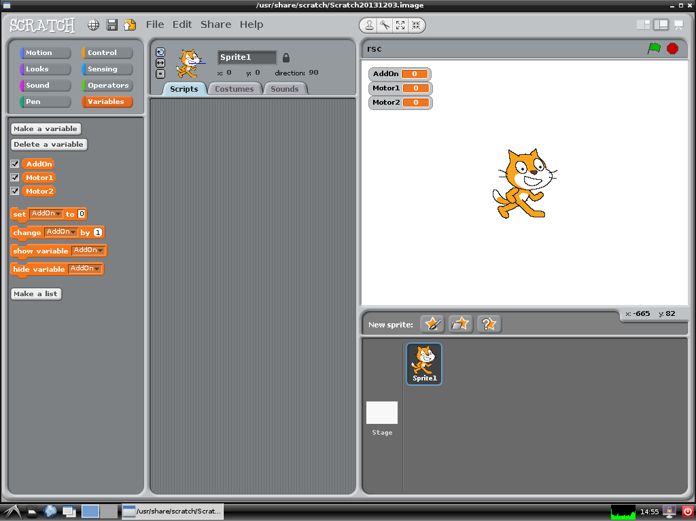
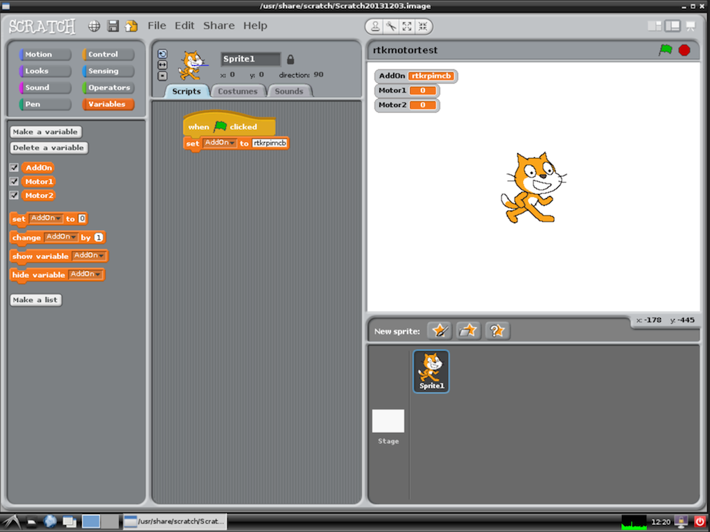
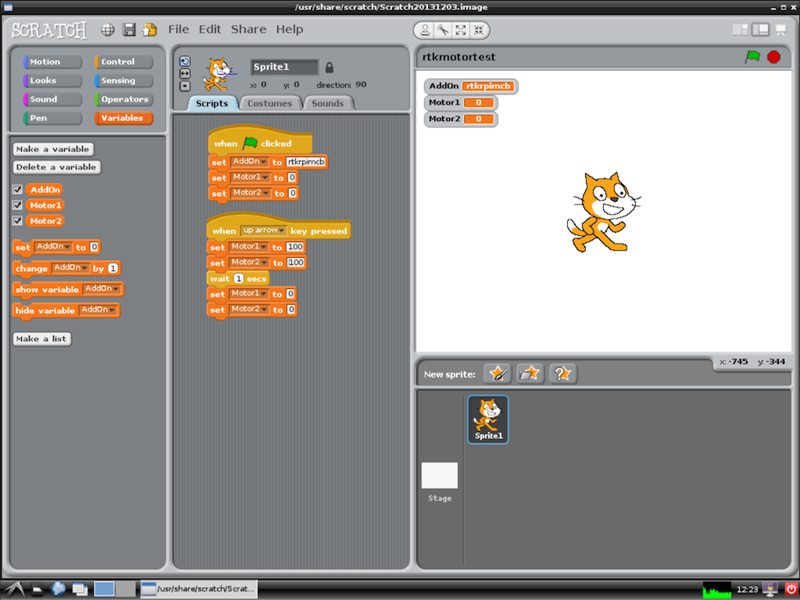
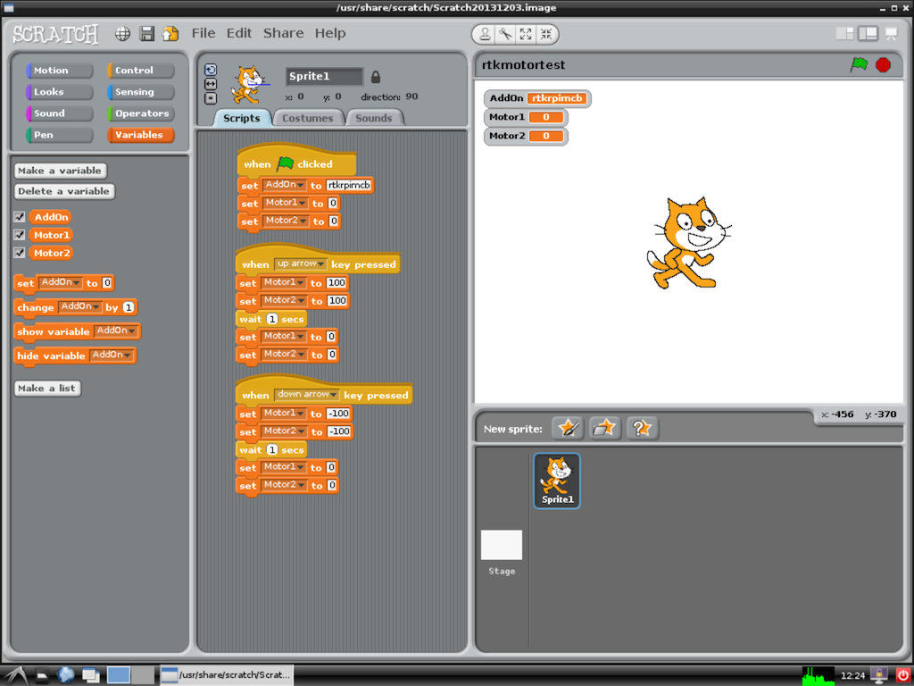

Scratch GPIO Tutorial
============
This guide will walk you through the instructions to configure your Raspberry Pi with ScratchGPIO & VNC, then Program up your robot using ScratchGPIO software.

The configuration stage is best performed by a person who has basic skills with using the command line. Once configured any age should be able to do the Programming with Scratch stage.

Configuration
--------------
###Pre Configuration
Your SD card should already be configured to the guide "raspberryPiSetup.md" located in the top folder. This will have your Raspberry Pi configured for use on a wireless connection, you may find for the installation of the software plugging in a wired ethernet connection may speed parts of this installation.

Next you will need to connect to your Raspberry Pi via an SSH Client. Details on how to connect can be found in the "handyTipsGuides" folder under "sshConnection".


###Scratch GPIO
Now we need to install scratch, first start by downloading the installer by using the command
```
wget http://goo.gl/Pthh62 -O isgh5.sh && sudo bash isgh5.sh
```
This will download the installer for ScratchGPIO V5 and install it.

After the installer finishes it should then say "Finished". 


###VNC
VNC or Virtual Network Computing is an method we can use to be able to run a Virtual Desktop on the Raspberry Pi and use it over the network. This is now used commonly in day to day computing for cloud services or remote assistance.

For this part we will be installing a VNC server allowing your other computer to connect to the Raspberry Pi.

*NOTE* a VNC server on a Raspberry Pi will not reduce network security unless you allow people manually via a method called Port Forwarding. You will also set-up a Password that is required to login to the Raspberry Pi.

First start by installing the tightvnc server using the command:

```
sudo apt-get install tightvncserver
```

Then we want to configure the server and add a password. Do this by typing in the command

```
tightvncserver
```
Set the password you will require to login to the server, we do not need a viewer password so press n for the view only password.

Next we want to download a piece of code that will allow us to automatically run this VNC Server on boot. This can be downloaded using the following command:
```
wget http://goo.gl/FlrtAW --no-check-certificate --trust-server-names
```
Finally we want to move it to the correct location and then set permissions. Copy the following code and enter it into the terminal:
```
sudo mv tightvncserver-init.txt /etc/init.d/tightvncserver
sudo chown root:root /etc/init.d/tightvncserver
sudo chmod 755 /etc/init.d/tightvncserver
sudo update-rc.d tightvncserver defaults
```
Finally reboot your Pi by running "sudo reboot" while also swapping over to wireless mode.

####Your Raspberry Pi Should now be ready for scratching!
####You will now need to connect to your Raspberry Pi using VNC. See the guide "connectingToVNC" in the handyTipsGuides folder on how to connect via an VNC Client.


Programming with Scratch
------------------------
First start by connecting to your Raspberry Pi using a VNC client over the network. This stage should be done over a wireless connection from where we are now going to program the robot.

We are going to program a simple robot controller using Scratch GPIO to teach you the basics of controlling the robot with scratch. After you can either then advance to do the same thing in Python or add in other parts to the scratch robot.

Now click on the Scratch GPIO 5 icon on the desktop, scratch will load and then display the message "Remote Sensor Connections Enabled" confirming scratch has been connected to the GPIO pins.
<a href="" target="_blank"></a>

Before we can control the GPIO pins we need to set up scratch to use the motor board. Do this by selecting the Variables tab and creating the variable ```addon```, also create the variables ```Motor1``` and ```Motor2```.
<a href="" target="_blank"></a>

Then drag in the set addon block into the main area and then dragging in When the green flag is clicked, after set the addon to ```RTKRpiMcb```, You can also add in two more set blocks to set Motor1 and Motor2 to 0.
<a href="" target="_blank"></a>


We will want to use the arrow keys to control the robot, the same keys can be substituted with A (Left), W (Up), S (Down) and D (Right).
Start by going to the control tab and dragging in the when key pressed block
<a href="" target="_blank"></a>


<a href="" target="_blank"></a>


---------------------------------------
Scratch GPIO is created by Simon Walters, Scratch is a project of the Lifelong Kindergarten Group at the MIT Media Lab.
Thanks to Penguin Tutor for letting me base the VNC installation off of his tutorial at http://www.penguintutor.com/linux/tightvnc , VNC Startup script also created by Penguin Tutor.


