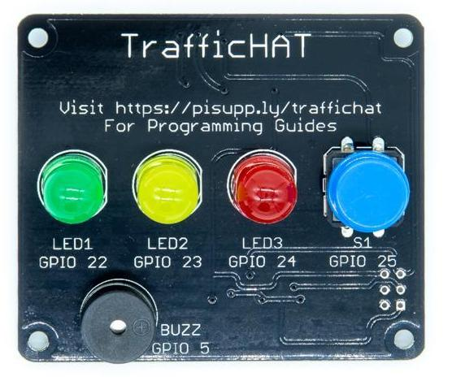

# RTK Traffic HAT

The traffic HAT is designed for beginners to teach the basics or programming the real world with a traffic light sequence of LEDs. The HAT has 3 on-board LEDs (Red, Yellow, Green) with a push button and piezo buzzer.

The TrafficHAT Comes fully pre-assembled and ready to go!

## Open Source Hardware

We are proud to say that the Traffic HAT is certified by the [Open Source Hardware Association](https://certification.oshwa.org/uk000012.html) with UID number UK000012. Our certification mark is below:

