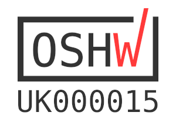

# RTK.GPIO Home


The RTK GPIO board allows you to connect the world of physical computing to you desktop PC or laptop. The RTK GPIO board emulates the original Raspberry Pi 40-pin GPIO header allowing you to program for the Raspberry Pi on your computer. The board is fully compatible with Windows, Mac OS and Linux and is designed to work with python.

The Python Library requires the following line in your code:

```python
from RTk import GPIO
```

## Open Source Hardware

We are proud to say that the RTk.GPIO is certified by the [Open Source Hardware Association](https://certification.oshwa.org/uk000015.html) with UID number UK000015. Our certification mark is below:



