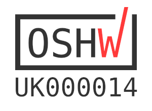

# Traffic pHAT

The Traffic pHAT is designed as a simple board to easily show the status of all the things!

The pHAT has 3 on-board LEDs (Red, Yellow, Green) and that's it!

The Traffic pHAT Comes fully pre-assembled and ready to go!

## Open Source Hardware

We are proud to say that the Traffic pHAT is certified by the [Open Source Hardware Association](https://certification.oshwa.org/uk000014.html) with UID number UK000014. Our certification mark is below:

